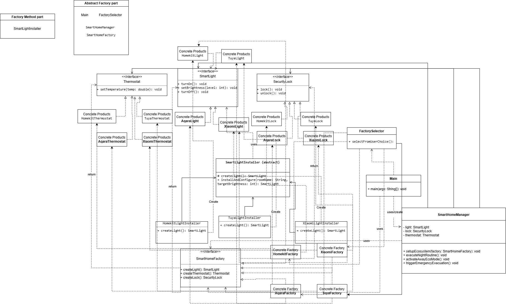

# Assignment 2 -- Factory Method & Abstract Factory

### Alisher Kairov

## Domain selection

**Smart Home**

## Part A -- Start Without Factories

In the initial version, SmartHomeManager directly created devices using constructors and if/else conditions. The system supported three product types - lights, locks, and thermostats across three families: HomeKit, Tuya, and Xiaomi.

```
if (platform.equalsIgnoreCase("Homekit")){
            this.light = new HomekitLight();
            this.lock = new HomekitLock();
            this.thermostat = new HomekitThermostat();
    }else if (platform.equalsIgnoreCase("Tuya")){
            this.light = new TuyaLight();
            this.lock = new TuyaLock();
            this.thermostat = new TuyaThermostat();
            ...
```

**Problems**

**Dependency on Concrete Classes:** SmartHomeManager directly references device implementations. Changes to their constructors may require changes to the manager.

**Difficult Extension:** Adding a new family requires modifying the conditions in both setUpEnvironment() and createExtraLight(). Existing client code must change whenever a new platform is introduced.

**Duplicated Creation Logic:** Both methods contain the same platform checks for creating lights. Updating only one method can lead to inconsistent platform support.

**Incompatible Product Combinations:** unsafeCustomSetup() allows devices from different families to be combined, such as a HomeKit light, a Tuya lock, and a Xiaomi thermostat. The interfaces enforce product types but do not guarantee that all devices belong to the same ecosystem.


## Part B -- Factory Method

I introduced the Factory Method pattern for creating smart lights. The abstract creator, SmartLightInstaller, defines createLight() and uses it within a shared installation workflow:

```
public abstract class SmartLightInstaller {
    protected abstract SmartLight createLight();

    public SmartLight installAndConfigure(String roomName, int targetBrightness){
        System.out.println("Installing a new light fixture " + roomName);

        SmartLight light = createLight();

        light.turnOn();
        light.setBrightness(targetBrightness);
        System.out.println("Diagnostic passed. Light fully configured for " + roomName);

        return light;
    }
}
```

Pattern Structure:
- **Product:** SmartLight.
- **Concrete Products:** HomekitLight, TuyaLight, and XiaomiLight.
- **Creator:** SmartLightInstaller.
- **Concrete Creators:** HomekitLightInstaller, TuyaLightInstaller, and XiaomiLightInstaller

**Meaningful Business Logic:** installAndConfigure() creates a light, turns it on, and sets its brightness. This workflow is shared across all families, while subclasses decide which concrete light to create. The diagnostic message is only simulated; no actual diagnostic check is performed.

**Improved Extensibility:** A new light family can be supported by adding a product and an installer subclass without changing the shared installation workflow. Device creation inside SmartHomeManager remains unchanged at this stage.

**Why Factory Method Instead of a Static Factory?** 

createLight() is an instance method overridden by subclasses. The selected installer determines which product is created through polymorphism. A static factory does not use overridden instance methods to delegate creation to subclasses.


## Part C -- Abstract Factory

I introduced the Abstract Factory pattern to create related smart home devices from the same ecosystem. The SmartHomeFactory interface defines methods for creating three product types:

```
package factory;

import model.*;


public interface SmartHomeFactory {
    SmartLight createLight();
    Thermostat createThermostat();
    SecurityLock createLock();
}
```

**Concrete Factories:**

- **HomekitFactory:** Creates HomeKit lights, thermostats, and locks.
- **TuyaFactory:** Creates Tuya lights, thermostats, and locks.
- **XiaomiFactory:** Creates Xiaomi lights, thermostats, and locks.

**Family Compatibility:** Using one factory for all three devices produces a consistent family. For example, HomekitFactory creates only HomeKit products, reducing the risk of accidentally mixing ecosystems.

**Reduced Coupling:** The client uses factory and product interfaces without directly calling concrete device constructors. Switching ecosystems requires selecting a different factory while keeping the device usage code unchanged.

**Difference from Factory Method:** Part B uses inheritance to customize light creation within an installation workflow. Part C uses a factory object to create a complete family of related devices.

## Part D -- Compatibility Rule

The compatibility rule requires the light, lock, and thermostat managed together to belong to the same smart home ecosystem.

SmartHomeManager now receives a single factory and uses it to create all three devices:

```
public void setupEcosystem(SmartHomeFactory factory){
        this.light = factory.createLight();
        this.lock = factory.createLock();
        this.thermostat = factory.createThermostat();
```

**Consistency by Design:** Each existing factory creates only products from its own family. For example, passing HomekitFactory produces a HomeKit light, lock, and thermostat.

**Preventing Mixed Combinations:** The device fields are private, and unsafeCustomSetup() was removed. Clients can no longer inject arbitrary combinations through that method. Family selection happens through one factory instead of separate device choices.

**Switching Ecosystems:** Calling setupEcosystem() with TuyaFactory replaces all three devices together, keeping the night routine unchanged.

## Part E -- Runtime Factory Selection

The application selects a product family at runtime through user input. FactorySelector.selectFromUserChoice() accepts a number or platform name and returns the corresponding SmartHomeFactory. Unknown input defaults to HomeKit.

**Centralized Selection:** Concrete factory creation is located in FactorySelector, avoiding repeated factory selection code in the client.

**Working Through Abstractions:** The selected factory is passed to SmartHomeManager, which creates devices through the SmartHomeFactory interface. The night routine uses product interfaces and does not need to know which ecosystem was selected.

**Dynamic Behavior:** Users can choose HomeKit, Tuya, or Xiaomi without changing or recompiling the application.

## Part F -- Business Scenario

SmartHomeManager implements three business operations, each coordinating multiple devices:

**Night Routine:** executeNightRoutine() locks the door, turns on the light at 10% brightness, and sets the temperature to 19°C to prepare the home for the night.

**Emergency Evacuation:** triggerEmergencyEvacuation() unlocks the door, turns on the light at full brightness, and sets the thermostat to 15°C as part of the simulated emergency scenario.

**Away Eco Mode:** activateAwayEcoMode() locks the door, turns off the light, and sets the temperature to 16°C to reduce energy use while the home is unoccupied.

All three operations use the SmartLight, SecurityLock, and Thermostat interfaces. The selected factory supplies the device family, so the same business logic works with HomeKit, Tuya, or Xiaomi without platform-specific conditions.

##  Part G -- Add a New Family

I extended the system by adding Aqara as the fourth smart home ecosystem. It includes all three required product types: a light, a lock, and a thermostat.


**ADDED**

devices/aqara/AqaraLight

devices/aqara/AqaraLock

devices/aqara/AqaraThermostat

factory/AqaraFactory

**MODIFIED**

factory/FactorySelector


**Impact on Existing Code:** No changes were required in SmartHomeManager, the product interfaces, or the existing factories. The night routine, away mode, and emergency evacuation operate through abstractions and therefore support the new family without modification.


## Part H -- UML



## Part I -- Automated Tests
I implemented 16 automated tests using JUnit 5 in SmartHomeEcosystemTest.

Test Coverage:
- **Product Creation:** Checks that HomeKit, Tuya, Xiaomi, and the new Aqara factory create the correct concrete lights, locks, and thermostats.
- **Family Consistency:** Verifies that HomeKit, Tuya, and Aqara factories return products belonging to their respective families.
- **Runtime Selection:** Checks that selecting "tuya" or "aqara" returns the appropriate factory.
- **Business Operations:** Checks that the night routine, emergency evacuation, and away eco mode execute without exceptions after initialization.
- **Negative Scenarios:** Expects IllegalArgumentException for an unknown platform name and a null factory.
- **Client Abstraction:** Passes all four factories through the SmartHomeFactory interface and executes the same manager operations.
- **Factory Method:** Checks that HomekitLightInstaller returns a non-null HomekitLight through the installation workflow.


The current business-operation tests verify execution without errors. Stronger behavioral verification would also check device actions and values, such as locking the door, setting brightness, and adjusting temperature.